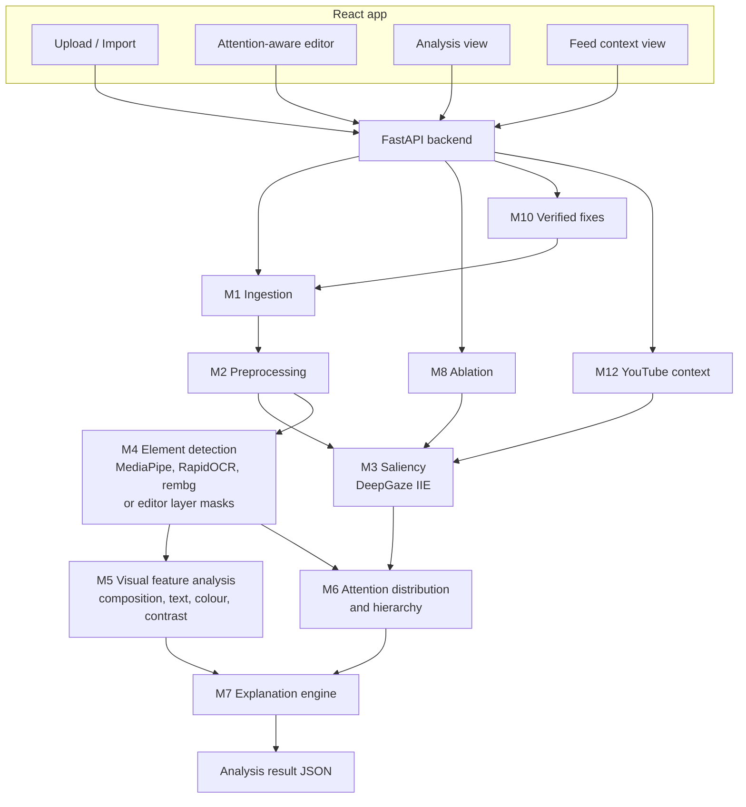

# PRD v2 — Thumbnail Attention Studio

AI-Powered YouTube Thumbnail Attention Heatmap · Version 2 · Last updated: Oct 3, 2026

> This document replaces PRD v1. v1 scope (scores, ONNX conversions, browser inference, Chrome extension, 9-model stack) is retired. See section 15 for what to remove from the existing code.

---

## 1. North star

**Problem statement (our first and ongoing goal):**

> Design and develop an AI-powered system that analyzes a YouTube thumbnail and generates an attention heatmap showing the areas that are most likely to attract visual attention. The system should go beyond simply identifying objects. It should analyze the composition, visual hierarchy, text placement, faces, subjects, colors, contrast, and other visual elements and estimate how viewer attention may be distributed across the thumbnail.

Every feature in this PRD must serve that statement. If a feature does not help **analyze visual elements** or **estimate how attention is distributed**, it is out of scope.

**What we ship:** an attention-aware thumbnail studio. It predicts where viewers look, breaks attention down by element, explains *why* each element gets the attention it gets, shows *what happens* when an element changes, and lets the creator fix the thumbnail in an editor while watching attention shift. It tests the thumbnail inside the real YouTube results it competes with.

**What we do not ship:** scores out of 100, click-through predictions, or LLM-written advice. Output is measured attention plus explanations grounded in measured features.

**Pitch:** Other tools tell you what's in your thumbnail. We show where attention actually goes, why, and what happens when you change it, tested inside the real YouTube results you're competing against.

---

## 2. Problem statement coverage

This matrix is the acceptance contract. Each row must be visible in the demo.

| PS requirement | How we deliver it | Where the user sees it |
| --- | --- | --- |
| Attention heatmap | DeepGaze IIE fixation density map | Heatmap overlay with opacity slider |
| Go beyond identifying objects | Per-element attention share, density, drivers and ablation, not labels | Attention breakdown panel |
| Composition | Thirds grid, visual balance (attention centre of mass), focal point count, negative space, safe zone | Composition layer view |
| Visual hierarchy | Predicted viewing order of elements + scanpath; intended vs predicted order check | Hierarchy panel, animated gaze path, intent check |
| Text placement | Text boxes vs attention map, attention per text block, mobile legibility test, contrast ratio, safe-zone overlap | Text layer view |
| Faces | Face detection, size, attention share, gaze direction (stretch) | Faces in breakdown, face layer view |
| Subjects | Subject segmentation (cutout), attention share, separation from background | Subject in breakdown |
| Colors | Dominant palette, saturation pop per element, palette vs competitors | Colour layer view, feed context |
| Contrast | Local contrast per element vs its surroundings, WCAG contrast for text | Contrast layer view, explanations |
| Other visual elements | Background and other regions as remainder; editor layers when available | Breakdown "other" rows |
| Estimate how attention is distributed | Attention % per element, density (attention % ÷ area %), flow on ablation | Attention budget bar, ablation flow |

---

## 3. Goals and non-goals

**Goals**

1. Produce a reliable attention heatmap for any 16:9 thumbnail.
2. Break attention down per element and explain each share with measured visual features.
3. Show visual hierarchy and compare it with the creator's intended hierarchy.
4. Show causal effects: where attention flows when an element is removed (ablation).
5. Let creators improve the thumbnail in an attention-aware editor, with every fix verified by re-analysis.
6. Place the thumbnail in real YouTube search results for its keyword and measure how it competes.
7. Verify the heatmap against human eye-tracking data.

**Non-goals**

- No 0–100 scores or grades.
- No LLM or generative AI APIs. Explanations come from a rules file over measured features.
- No click-through-rate prediction.
- No Chrome extension, ONNX conversion or in-browser model inference.
- No dependency on internet for the core analysis (YouTube features need internet; the core does not).

**Constraints**

- Hackathon timeline, team of 2 to 3, testing limited to 2 to 3 people.
- CPU-only inference on a laptop; plain PyTorch and pip packages.
- Only models with ready pretrained weights. No training is required for the MVP.

---

## 4. Users and core journey

**Primary user:** a YouTube creator finalizing a thumbnail before upload. **Secondary:** thumbnail designers who need to justify design choices.

**The studio flow (one linear journey):**

1. **Create or import.** Upload an image, build one in the editor, or import a past thumbnail from the creator's channel (YouTube API).
2. **Set intent.** Drag the detected elements into the order the creator wants them seen (for example: face → title → product).
3. **Analyze.** Heatmap, attention breakdown, hierarchy, explanations, layer views, intent check.
4. **Explore causes.** Ablate any element and see where its attention goes.
5. **Fix in the editor.** Move, resize, restyle, or apply a one-click fix; the attention budget bar updates.
6. **Compare versions.** Before/after heatmaps and how attention shifted.
7. **Test in context.** See the thumbnail in a real YouTube results page for the target keyword and measure its share of attention.
8. **Export.** Download 1280×720 JPG under 2 MB. Stretch: publish to the video via the YouTube API.

---

## 5. Product features

| Feature | MVP | Stretch |
| --- | --- | --- |
| Heatmap | DeepGaze IIE map, overlay with opacity slider, colour legend | Mobile / desktop / sidebar size previews |
| Attention breakdown | Attention %, area %, density per element; sorted list | Per-element attention over versions chart |
| Visual hierarchy | Predicted order of elements, 3–5 fixation scanpath animation | Hierarchy diagram with arrows between elements |
| Intent check | Drag-to-rank intended order; mismatches highlighted with explanation | Agreement metric (Kendall tau) |
| Explanations | 2–4 measured reasons per element from rules file | "Strongest driver" badge per element |
| Element ablation | Remove one element, show attention flow to other elements | Ablate all elements in one run, flow matrix |
| Layer views | Composition, text, faces/subject, colour, contrast, safe zone | Gaze-direction arrow from faces |
| Attention-aware editor | Layers (image, cutout, text, shape), move/resize/style, live attention budget bar | Templates, stickers, snapping to thirds |
| Verified fixes | Focus subject, fix text legibility, clear safe zone, enhance, separate layers | Rebalance to thirds |
| Versions | Save versions, before/after heatmaps, attention shift per element | Branching versions |
| YouTube feed context | Search keyword, render results grid with your thumbnail, attention share vs competitors | Home-feed and sidebar layouts |
| Competitor colours | Dominant palettes of top results, contrast suggestion | Niche colour trends |
| Channel import | List creator's recent videos, import a thumbnail into the editor | Attention patterns vs relative views |
| Title pairing | Flag thumbnail text that repeats the video title | — |
| Publish | — | `thumbnails.set` via OAuth |
| Verification | Evaluation on public eye-tracking data; results page | Live WebGazer demo |

---

## 6. Architecture



**Single analysis, step by step**

1. The client sends an image, plus optional editor layers (masks + names) and optional intended order.
2. M1 normalizes to 1280×720 and hashes; a cache hit returns immediately.
3. M2 builds the model input, the 168 px mobile render and the safe-zone mask.
4. M3 (saliency) and M4 (elements) run in parallel.
5. M5 measures visual features per element and for the whole frame.
6. M6 computes attention share, density, hierarchy and scanpath; compares against intent.
7. M7 turns measured features into explanations using `rules.yaml`.
8. The backend returns heatmap PNG, elements, hierarchy, scanpath, layer data and explanations.

---

## 7. Module specifications

Every module is a Python package with one public function and typed inputs and outputs. A module failing returns `null` for its part of the response with an error note; the request never fails as a whole.

### M1. Ingestion

- Inputs: uploaded file (JPG, PNG, WEBP), editor export, or YouTube video ID.
- Video ID → fetch `https://i.ytimg.com/vi/<id>/maxresdefault.jpg`, fallback `hqdefault.jpg` (crop letterbox bars).
- Normalize to 1280×720 RGB (centre-crop to 16:9, then resize).
- SHA-256 of normalized pixels + layer payload = cache key.
- **Done when:** any valid input becomes a 1280×720 array and a hash.

### M2. Preprocessing

- Model input for DeepGaze IIE (downscale, keep aspect).
- Mobile render: resize to 168×94 with `INTER_AREA`, then back up for OCR (legibility test).
- Safe-zone mask: duration badge region (bottom-right, about 14% width × 12% height) and progress bar strip (bottom 3%). Constants in `config.yaml`.
- **Done when:** a `Context` object carries all views and masks.

### M3. Saliency

- **Primary:** DeepGaze IIE (`deepgaze_pytorch`), pretrained, with the MIT1003 centre-bias template from the official repo, resized to the input.
- Output: 1280×720 float map, normalized to sum to 1 (a probability distribution, so element shares are well defined).
- **Fallback:** OpenCV fine-grained static saliency, used automatically if DeepGaze fails to load, so the pipeline never breaks. Response includes `saliency_model` so the UI can show which ran.
- Model loads once at startup; inference under `torch.inference_mode()`.
- **Done when:** heatmap overlays correctly on 10 varied thumbnails and timing is recorded.

### M4. Element detection

Produces a list of elements, each with `id`, `type`, `label`, binary `mask`, `box`.

| Type | Source | Notes |
| --- | --- | --- |
| face | MediaPipe Face Detection | Box expanded 15% for hair/edges; mask = ellipse in box |
| text | RapidOCR | One element per line or merged block; recognized string kept |
| subject | rembg (u2net) | Largest connected component(s); faces and text subtracted |
| background | Remainder | Everything not covered by other elements |
| layer | Editor payload | **When the editor sends layers, they replace detection**: exact masks, user-given names |

- Overlaps resolved by priority: text > face > subject > background, so every pixel belongs to exactly one element.
- **Done when:** elements cover 100% of pixels with no overlap, verified on 10 thumbnails.

### M5. Visual feature analysis

Measured per element (E) and for the frame (F). These are the only inputs explanations may use.

| Feature | Scope | Method |
| --- | --- | --- |
| Area % | E | mask pixels ÷ total |
| Position | E | centroid; distance to nearest thirds point; distance to centre |
| Local contrast | E | luminance RMS difference between element and a 24 px ring around it |
| Text contrast ratio | E (text) | WCAG ratio between text pixels and surrounding background |
| Saturation pop | E | mean saturation (HSV) of element minus frame mean |
| Colour distinctness | E | LAB distance of element mean colour from frame mean |
| Mobile legibility | E (text) | OCR on the mobile render recovers the string (edit distance ≤ 30%) |
| Safe-zone overlap | E | % of element mask inside the safe-zone mask |
| Palette | F | k-means (k=5) in LAB, colour names + shares |
| Balance | F | attention centre of mass vs frame centre |
| Focal points | F | heatmap peaks after non-max suppression |
| Negative space | F | % of pixels with attention below a low threshold |
| Gaze direction (stretch) | E (face) | MediaPipe Face Mesh + solvePnP yaw/pitch |

### M6. Attention distribution and hierarchy

- **Attention share** of element = sum of saliency map inside its mask (map sums to 1).
- **Density** = attention share ÷ area share. Above 1 means the element pulls more than its size; below 1 means less.
- **Scanpath (M3b):** DeepGaze III (`deepgaze_pytorch`, same package, 83 MB weights) predicts each next fixation from the image and the fixations so far, 5 fixations, starting from the frame centre. The start and every earlier fixation are excluded by a radius of 9% of the frame width, because the model's best next guess is otherwise "stay here". The chain is deterministic. Each fixation is labelled with the element it lands on. If DeepGaze III is unavailable, winner-take-all with a hard minimum distance on the saliency map is used instead (3–5 fixations).
- **Hierarchy:** elements in the order the scanpath first visits them, then the rest ranked by peak attention (ties broken by share). Without a scanpath model: all elements by peak attention. This is "what viewers see first, second, third".
- **Intent check:** if the user sent an intended order, list each element whose predicted rank differs from its intended rank, with the rank gap.
- **Done when:** shares sum to 100% (±0.5) and the hierarchy is stable across repeated runs.

### M7. Explanation engine

- Rules live in `backend/app/explain/rules.yaml`. Each rule: condition over M5/M6 features, message template, priority.
- Every message must cite at least one measured number. No unmeasured claims.
- Example rules:

```yaml
- id: text_low_contrast
  applies_to: text
  when: "text_contrast_ratio < 3.0"
  message: "{label} gets {attention_pct}% of attention while covering {area_pct}% of the frame. Its contrast against the background is only {text_contrast_ratio}:1."
- id: element_punches_above
  applies_to: any
  when: "density >= 2.0"
  message: "{label} draws {density}x more attention than its size suggests, driven by {top_driver}."
- id: text_not_mobile_legible
  applies_to: text
  when: "mobile_legible == false"
  message: "\"{text}\" is not readable at mobile size. Viewers on phones will skip it."
- id: in_safe_zone
  applies_to: any
  when: "safe_zone_overlap_pct > 20"
  message: "{safe_zone_overlap_pct}% of {label} sits under the YouTube timestamp."
- id: hierarchy_mismatch
  applies_to: any
  when: "intent_rank is not None and predicted_rank != intent_rank"
  message: "You want {label} seen #{intent_rank}, but viewers will see it #{predicted_rank}."
```

- `top_driver` = the feature with the largest normalized value among local contrast, saturation pop, colour distinctness, face, centrality.
- Output per element: 2–4 messages sorted by priority; plus 1–3 frame-level messages (balance, focal points, palette).

### M8. Element ablation

- Input: analysis ID + element ID.
- Remove the element: small elements (text, graphics) with `cv2.inpaint` (Telea); large elements (subject, face) by filling the mask with a heavily blurred version of the surrounding background.
- Re-run M3 on the edited image; compute new shares for the remaining elements.
- Output: original share of the removed element and **where it went** (delta per remaining element), plus the ablated heatmap.
- Message example: "Without the arrow, its 15% splits: background +9%, product +4%, title +2%."
- **Done when:** deltas sum to the removed share (±1%) and the UI shows a flow view.

### M9. Attention-aware editor

- react-konva canvas at 1280×720, display-scaled.
- Layer types: image, subject cutout, text (font, size, fill, stroke, shadow), shape (rect, circle, arrow).
- Each layer has a name the user can edit; names flow into the breakdown.
- On change (debounced 600 ms): export flattened PNG + per-layer alpha masks → `/analyze` with `layers`.
- **Attention budget bar:** horizontal stacked bar of attention per layer, updated after each analysis, with arrows showing change since the last run.
- Panels: heatmap toggle, layer views, intent ranking, explanations.
- **Done when:** moving a text layer visibly changes its share in the budget bar.

### M10. Verified fixes

Each fix produces a new version, re-runs analysis, and reports the attention change for the affected elements.

| Fix | Method | Works on |
| --- | --- | --- |
| Focus subject | Background: Gaussian blur + darken 25%; subject: 6 px outline from dilated mask | Flat images and editor |
| Fix text legibility | Add stroke and shadow; increase size in steps until mobile legibility passes | Editor text layers |
| Clear safe zone | Move overlapping layers up/left out of the safe zone | Editor layers |
| Enhance | CLAHE on LAB L channel, +10% saturation | Flat images and editor |
| Separate layers | rembg cutout → subject layer + background layer | Flat images → editor |
| Rebalance (stretch) | Move the intended #1 layer to the nearest thirds point | Editor layers |

- Message example: "Focus subject: subject 21% → 44%, background 52% → 30%."

### M11. Versions and comparison

- Every analyze/fix in a session saves a version (image, layers JSON, analysis result).
- Compare view: two heatmaps side by side, per-element attention change table, hierarchy before/after.

### M12. YouTube context (YouTube Data API v3)

API key in `.env` as `YOUTUBE_API_KEY`. Responses cached on disk for 24 h to protect quota.

| Capability | Endpoint | Cost (units) | Use |
| --- | --- | --- | --- |
| Feed context | `search.list` (type=video, q=keyword, maxResults=12) | 100 | Competitor thumbnails + titles for a keyword |
| Video details | `videos.list` (snippet, statistics) | 1 | Title, channel, views for the results grid and title pairing |
| Channel import | `channels.list` → uploads playlist → `playlistItems.list` | 1 each | Creator's recent thumbnails |
| Publish (stretch) | `thumbnails.set` with OAuth | 50 | Set the final thumbnail on the video |

- **Feed context:** compose a 1280-wide image of a YouTube results grid (thumbnails at real size, titles beneath) with the user's thumbnail placed in position 3. Run M3 on the composite. Report the user's tile attention share vs the average tile and vs the top tile.
- **Competitor colours:** k-means palette across the competitor thumbnails; flag when the user's dominant colour matches the majority, and name the least-used high-contrast hue.
- **Title pairing:** compare OCR text with the video title; flag when more than 60% of thumbnail words repeat the title.
- **Channel patterns (stretch):** attention breakdown of past thumbnails beside views ÷ channel median; presented as patterns, never as predictions.
- Default quota is 10,000 units/day; one feed search costs about 100–110 units. Check current costs in the YouTube API docs before relying on them.

### M13. Verification

- `ml/eval.py` computes CC, NSS, KLD and AUC-Judd for DeepGaze IIE vs the OpenCV fallback on a held-out subset of a public eye-tracking dataset (UEyes posters or CAT2000 categories closest to thumbnails).
- Results shown on an in-app "How we know" page with 3–4 predicted vs human examples.
- Stretch: WebGazer live demo, 9-point calibration, 3 s view, fixations vs predicted map.

### M14. Backend platform

- FastAPI + Uvicorn; models load at startup; M3 and M4 run in a thread pool in parallel.
- Storage: SQLite (sessions, versions, analyses), disk for images and heatmaps, disk cache for YouTube responses.
- `timing_ms` per module in every response.

---

## 8. Models and libraries

Only components with ready pretrained weights. No training needed for the MVP.

| Component | Package | Used in | Notes |
| --- | --- | --- | --- |
| DeepGaze IIE | `deepgaze_pytorch` (official GitHub repo) | M3, M8, M12 | Needs centre-bias `.npy` from the repo |
| DeepGaze III | `deepgaze_pytorch` | M3b scanpath | Predicts the next fixation from the fixations so far |
| OpenCV fine-grained saliency | `opencv-contrib-python` | M3 fallback | No weights |
| MediaPipe Face Detection | `mediapipe` | M4 | CPU, fast |
| RapidOCR | `rapidocr-onnxruntime` | M4, M5 | Ships its own models |
| rembg (u2net) | `rembg` | M4, M10 | Downloads weights on first run |
| MediaPipe Face Mesh | `mediapipe` | M5 stretch | Gaze direction |
| Classical CV | `opencv`, `numpy`, `scipy`, `scikit-learn` | M5, M6, M8, M10 | Contrast, palette, peaks, inpainting, CLAHE |

Pre-download all weights before the event; the demo machine must run the core offline.

---

## 9. API contract

### Endpoints

| Method | Path | Body | Returns |
| --- | --- | --- | --- |
| POST | `/analyze` | `image` file, optional `layers` JSON, optional `intent` (element ids in order) | Analysis result |
| POST | `/ablate` | `analysis_id`, `element_id` | Ablation result |
| POST | `/fix` | `analysis_id`, `fix` (focus_subject, fix_text, clear_safe_zone, enhance, separate_layers), optional `layers` | New version + analysis + changes |
| GET | `/versions/{session_id}` | — | Version list |
| GET | `/compare` | `a`, `b` version ids | Per-element change, both heatmaps |
| GET | `/youtube/feed` | `q`, `analysis_id` | Composite image, tile shares, competitor palette |
| GET | `/youtube/channel` | `channel_id` or handle | Recent videos with thumbnails |
| GET | `/youtube/video/{id}` | — | Title, stats, thumbnail URL, title pairing check |
| GET | `/health` | — | Loaded models, fallback status |

### Analysis result

```json
{
  "analysis_id": "sha256...",
  "session_id": "uuid",
  "saliency_model": "deepgaze_iie",
  "heatmap_png": "base64...",
  "image_jpg": "base64...",
  "image_info": {"source_size": [1920, 1080], "format": "JPEG", "fit": "none"},
  "cached": false,
  "elements": [
    {
      "id": "face_0",
      "type": "face",
      "label": "Face",
      "box": [300, 120, 520, 400],
      "mask_rle": "...",
      "area_pct": 12.1,
      "attention_pct": 47.8,
      "density": 3.95,
      "predicted_rank": 1,
      "intent_rank": 1,
      "features": {
        "local_contrast": 0.42,
        "saturation_pop": 0.08,
        "colour_distinctness": 18.3,
        "dist_to_thirds": 0.04,
        "safe_zone_overlap_pct": 0.0
      },
      "top_driver": "face",
      "explanations": [
        "Face draws 3.9x more attention than its size suggests, driven by the face itself and high local contrast."
      ]
    },
    {
      "id": "text_0",
      "type": "text",
      "label": "I QUIT",
      "text": "I QUIT",
      "box": [700, 80, 1200, 260],
      "area_pct": 9.4,
      "attention_pct": 11.2,
      "density": 1.19,
      "predicted_rank": 3,
      "intent_rank": 2,
      "features": { "text_contrast_ratio": 2.4, "mobile_legible": false },
      "explanations": [
        "You want I QUIT seen #2, but viewers will see it #3.",
        "Its contrast against the background is only 2.4:1."
      ]
    }
  ],
  "hierarchy": ["face_0", "subject_0", "text_0", "background"],
  "scanpath": [
    {"x": 410, "y": 230, "order": 1, "element_id": "face_0"},
    {"x": 880, "y": 410, "order": 2, "element_id": "subject_0"}
  ],
  "frame": {
    "palette": [{"hex": "#E8352B", "share": 0.31}],
    "balance_offset": [0.12, -0.05],
    "focal_points": 2,
    "negative_space_pct": 38.0,
    "explanations": ["Attention is weighted to the left third; the right side carries little."]
  },
  "intent_check": {"matches": false, "mismatches": [{"element_id": "text_0", "intended": 2, "predicted": 3}]},
  "layer_views": {"composition": {}, "text": {}, "colour": {}, "contrast_png": "base64...", "safe_zone": {}},
  "timing_ms": {"saliency": 0, "elements": 0, "features": 0, "total": 0},
  "errors": []
}
```

### Ablation result

```json
{
  "removed": {"element_id": "shape_arrow", "attention_pct": 15.0},
  "flow": [
    {"element_id": "background", "delta_pct": 9.1},
    {"element_id": "subject_0", "delta_pct": 4.2},
    {"element_id": "text_0", "delta_pct": 1.7}
  ],
  "ablated_heatmap_png": "base64...",
  "message": "Without the arrow, its 15% splits: background +9.1%, product +4.2%, title +1.7%."
}
```

---

## 10. Frontend screens

1. **Start:** upload, open editor, or import from channel (YouTube).
2. **Studio (main screen):**
   - Centre: canvas with heatmap overlay and scanpath.
   - Left: layers (editor) and intent ranking (drag to order).
   - Right: attention breakdown (element, attention %, area %, density bar, rank), explanations per element, layer view toggles.
   - Top: attention budget bar; fix buttons; version switcher.
3. **Ablation view:** click an element → flow view showing where its attention went, before/after heatmaps.
4. **Compare:** two versions side by side with the change table.
5. **Feed context:** keyword search → results grid with the thumbnail in place, tile heatmap overlay, share vs competitors, competitor palette.
6. **How we know:** evaluation metrics and predicted vs human examples.

UI rules: the heatmap colour scale always has a legend; every percentage shows one decimal; no grades, badges or scores anywhere.

---

## 11. Non-functional requirements

| Area | Requirement |
| --- | --- |
| Reliability | Pipeline never fails as a whole; fallback saliency if DeepGaze fails; per-module errors in `errors` |
| Latency | Full analysis target under 5 s on a laptop CPU; measured from day one; cache repeat analyses |
| Editor feel | Debounced analysis; previous heatmap stays visible with an "updating" state |
| Offline core | Analysis, ablation, fixes, editor work without internet |
| Quota safety | YouTube responses cached 24 h; feed search only on explicit user action |
| Privacy | Images and sessions stay on the local machine; API key never sent to the client |
| Truthfulness | Every explanation cites a measured number; no claims about clicks or views |
| Modularity | Each module replaceable behind its function signature |

---

## 12. Repository structure

```
thumbnail-heatmap/
├── docs/PRD.md
├── backend/
│   ├── app/
│   │   ├── main.py              # FastAPI app, startup model loading
│   │   ├── api/                 # routes: analyze, ablate, fix, versions, youtube, health
│   │   ├── ingest/              # M1
│   │   ├── preprocess/          # M2
│   │   ├── saliency/            # M3 DeepGaze IIE + fallback
│   │   ├── elements/            # M4 faces, text, subject, layers
│   │   ├── features/            # M5
│   │   ├── attention/           # M6 shares, density, hierarchy, scanpath, intent
│   │   ├── explain/             # M7 engine + rules.yaml
│   │   ├── ablation/            # M8
│   │   ├── fixes/               # M10
│   │   ├── youtube/             # M12 client, cache, feed composite
│   │   └── storage/             # M11, M14 SQLite + disk
│   ├── config.yaml
│   ├── requirements.txt
│   └── weights/                 # centre-bias and downloaded weights (gitignored)
├── frontend/
│   └── src/
│       ├── pages/               # Start, Studio, Compare, Feed, HowWeKnow
│       ├── editor/              # react-konva canvas, layers, export
│       ├── analysis/            # breakdown, explanations, budget bar, layer views
│       └── api/                 # typed client
├── ml/
│   └── eval.py                  # M13 metrics
└── data/                        # samples, public eval subset, cache (gitignored)
```

---

## 13. Build plan

Each phase ends with an exit check. Do not start the next phase until it passes.

1. **Core heatmap.** M1, M2, M3 with fallback; `/analyze` returns a heatmap; frontend overlay.
   - Exit: 10 varied thumbnails produce sensible heatmaps; timing logged.
2. **Elements and distribution.** M4, M6; breakdown panel with attention %, area %, density, hierarchy, scanpath.
   - Exit: shares sum to 100%; every pixel belongs to one element.
3. **Explanations.** M5, M7; layer views; intent ranking and check.
   - Exit: every element has at least one explanation citing a measured number.
4. **Editor.** M9 with layer masks sent to `/analyze`; attention budget bar.
   - Exit: moving a text layer changes its share on screen.
5. **Causes and fixes.** M8 ablation; M10 fixes; M11 versions and compare.
   - Exit: ablation deltas sum correctly; each fix shows a before/after change.
6. **YouTube context.** M12 feed composite, competitor colours, channel import, title pairing.
   - Exit: keyword search shows the thumbnail in a real results grid with its attention share.
7. **Verification and polish.** M13 evaluation, How we know page, demo rehearsal.
   - Exit: metrics table and examples ready; full demo runs in under 4 minutes.

**Cut order if behind:** channel patterns → publish → rebalance fix → gaze direction → WebGazer → compare view (keep versions list).
**Never cut:** heatmap, attention breakdown with explanations, hierarchy + intent check, ablation, editor budget bar.

---

## 14. Success criteria

- [ ] Every row of the PS coverage matrix (section 2) is visible in the demo
- [ ] Attention shares sum to 100% and are shown per element with area and density
- [ ] Hierarchy and scanpath shown; intent check flags mismatches
- [ ] Every explanation cites a measured number
- [ ] Ablation shows where a removed element's attention goes
- [ ] Editor budget bar updates after a change; at least 3 fixes show measured before/after changes
- [ ] Feed context places the thumbnail among real YouTube results and reports its share
- [ ] DeepGaze IIE beats the classical baseline on held-out human eye-tracking data
- [ ] Core analysis runs offline on one laptop

**Demo script (target 4 minutes):** upload a weak thumbnail → set intent (title should be #2) → analysis shows the title at #4 with low contrast and mobile illegibility → ablate the arrow and show where attention flows → open the editor, apply Fix text and Focus subject, budget bar shifts → feed context for the keyword shows the improved version holding more attention among real competitors → How we know page.

---

## 15. Migration from v1

**Remove**

- All 0–100 scores, `scoring.yaml`, score UI components and score fields in API responses.
- ONNX export/conversion code and `.onnx` model files.
- SimpleNet, FastSal, MSI-Net, UMSI code and weights.
- YOLO, HSEmotion and any object-class labelling.
- Browser-side inference (ONNX Runtime Web, TF.js model loading).
- `extension/` folder (Chrome extension).
- Fusion weight fitting and pseudo-labelling notebooks.
- v1 recommendation rules that output advice without measured numbers.

**Keep and adapt (if present)**

- FastAPI app skeleton, upload handling, hashing and cache → M1, M14.
- Resize and safe-zone code → M2.
- RapidOCR and face detection code → M4 (switch faces to MediaPipe if another detector is unstable).
- Colour, contrast and composition helpers → M5.
- Scanpath (winner-take-all + inhibition of return) → M6.
- React app shell, upload page, heatmap overlay component → Studio screen.
- Any react-konva or Fabric.js editor work → M9 (react-konva is the v2 choice).
- WebGazer page → M13 stretch.

**New**

- DeepGaze IIE saliency with fallback (M3).
- Element masks covering every pixel, editor layer masks as input (M4).
- Density, hierarchy, intent check (M6).
- Measured-number explanations (M7).
- Ablation (M8), verified fixes (M10), versions (M11).
- YouTube Data API integration (M12).

---

## 16. Risks

| Risk | Mitigation |
| --- | --- |
| DeepGaze IIE slow on CPU | Cache by hash; downscale input; debounce editor; measure on day one |
| DeepGaze install issues | Pin versions; pre-download centre bias and backbone weights; fallback saliency keeps the app working |
| rembg cutout poor on busy images | Manual mask brush in the editor (stretch); background remainder still covers pixels |
| OCR misses stylized fonts | Editor text layers bypass OCR; undetected text can be marked via layers |
| Inpainting artefacts in ablation | Blur-fill for large regions; show the ablated image so users see what was removed |
| YouTube quota exhausted | 24 h cache; search only on demand; pre-cache demo keywords |
| Scope creep | PS coverage matrix is the filter; cut order is fixed |

---

## 17. Future scope

- Fine-tune saliency on thumbnail-specific eye-tracking data collected with consent.
- Gaze-direction cueing analysis (faces looking at text or product).
- Niche-specific explanation thresholds learned from top-performing thumbnails per niche.
- Import results from YouTube's native thumbnail test-and-compare for analysis.
- Video frame mining: suggest strong candidate frames from an uploaded video.
